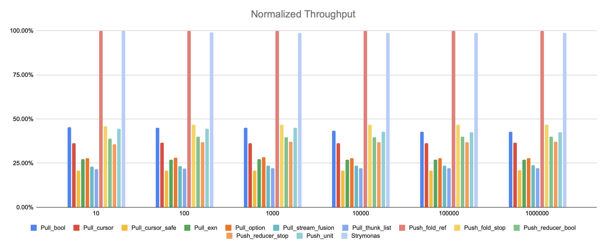

# Streams Benchmarks

An ongoing effort to understand and document the performance characteristics of streaming models available for OCaml.


## Results

The results for the benchmarks presented here were run on a MacBook Pro with the **M1** ARM CPU.

The benchmarks were built with the flambda variant of the 4.14.0 compiler with the `-O3` flags.



> Higher values mean faster execution time.

Detailed benchmark results (including on AMD CPUs) can be found [here](https://docs.google.com/spreadsheets/d/1OdlEwwunb4ibhHgkwR0I4cRIgOIOHqXRZTtxtoTd6JE).

## Implemented models

All the models presented here were implemented from scratch in this repository
to provide a clean reproducible environment and consisten compilation flags.


Below is the overview of some of the implemented models.

### `Strymonas`

A staged stream implementation for BER MetaOCaml (https://strymonas.github.io).
This models produces agressively inlined imperative code removing all of the
intermediate abstractions.

Due to the fact that it is a staged model, it requires either the BER MetaOCaml
compiler or [`ppx_stage`](https://github.com/stedolan/ppx_stage). The included
benchmark is implemented with `ppx_stage` in the `ppx_stage_strymonas` directory.

For simpliciy the generated code is included inline in the benchmarks.

### `Stdlib.Seq` (`Pull_thunk_list`)
Model used in [Stdlib.Seq](https://github.com/ocaml/ocaml/blob/4.10/stdlib/seq.mli). This is an iterator similar to lists albeit lazy,
protected with a thunk.

```ocaml
type +'a node =
  | Nil
  | Cons of 'a * 'a t

and 'a t = unit -> 'a node
```

### `Streaming.Source` (`Pull_cursor`, `Pull_cursor_k` and `Pull_cursor_safe`)
Model used in [Streaming.Source](https://github.com/odis-labs/streaming).
Iterators based on the "unfold" function. They put an explicit state in the
type making them easy to implement and reason about. The `_k` and `_safe`
variants attempt to implement them using CPS and add resource handling.

```ocaml
(* Pull_cursor *)
type +'a t = Iter : 's * ('s -> ('a * 's) option) -> 'a t

(* Pull_cursor_k *)
type ('a, 's) iter = {
  init : 's;
  next : 'r . ('a -> 's -> 'r) -> 's -> (unit -> 'r) -> 'r;
}
type 'a t = Iter : ('a, 's) iter -> 'a t

(* Pull_cursor_safe *)
type 'a t =
  Iter : {
    init : unit -> 's;
    next : 'r . ('a -> 's -> 'r) -> (unit -> 'r) -> 's -> 'r;
    stop : 's -> unit;
  } -> 'a t
```

### `Gen` (`Pull_option`)
Model used in [Gen](https://github.com/c-cube/gen). This is a simple pull iterator similar in spirit to `Pull_cursor` but without explicit state. The implementation of combinators is forced to used mutable state for control management.

### `Base.Sequence` (`Pull_stream_fusion`)
Model used in
[Base.Sequence](https://github.com/janestreet/base/blob/v0.14.0/src/sequence.mli).
This iterator is very well known for being used as a "stream fusion" mechanism
for Haskell lists. It is structurally similar to `Pull_cursor` but has an extra
variant for skipping elements.

```ocaml
type ('a, 's) step =
  | Done
  | Skip  of 's
  | Yield of 'a * 's
type +_ t =
  Stream : 's * ('s -> ('a, 's) step) -> 'a t
```

### `Streaming.Stream` (`Push_reducer_bool` and `Push_reducer_stop`)
Model used in [Streaming.Stream](https://github.com/odis-labs/streaming). A
push-based iterator with great performance and built-in resource handling. This
implementation is inspired by Clojure's transducers. It can be thought of as
"fold fusion with resource handling" The `Push_reducer_stop` variant encodes
termination in reducers as a variant value instead of using a boolean.

```ocaml
(* Push_reducer_bool *)
type ('a, 'b) reducer =
  Reducer : {
    init : unit -> 'acc;
    step : 'acc -> 'a -> 'acc;
    full : 'acc -> bool;
    stop : 'acc -> 'b;
  } -> ('a, 'b) reducer
type 'a t =
  { reduce : 'r . ('a, 'r) reducer -> 'r }


type 'a reduced = Done of 'a | Continue of 'a
type ('a, 'r) reducer =
  Reducer : {
    init : 's;
    step : 'a -> 's -> 's reduced;
    stop : 's -> 'r;
  } -> ('a, 'r) reducer
type 'a t = { run : 'r . ('a, 'r) reducer -> 'r}
```

### `Push_fold_ref`
A fold with a boolean reference to denote termination. This is one of the most
efficient streaming models without resource management.

With the current version of flambda adding `[@inline]` attributes in the user
code can lead to significant speed ups.

```ocaml
type +'a t = { fold : 'r. 'r -> ('r -> 'a -> 'r) -> bool ref -> 'r }
```

### `Push_fold_stop`
A fold with termination that can be fused to created nested computations that
form streams. Similar in spirit to `Push_reducer_bool`, but lacks resource
handling. Writing combinators in this style is somewhat complicated.

```ocaml
type 'a t = { run : 'r . ('r -> 'a -> 'r option) -> 'r -> 'r }
```


### `Iter` (`Push_unit`)
Model used in [Iter](https://github.com/c-cube/iter). This is a very simple
push-based iterator. It has excellent performance and supports efficient
concatentation and unzipping. Its minimal interface imposes the use mutations
and exceptions for control management. It also lacks support for resource
handling.

```ocaml
type 'a t = ('a -> unit) -> unit
```

## Running the benchmarks


```
$ dune exec --profile=release src/Main.exe
```

This will run all of the benchmarks with inputs ranging from 10 to 1000000. The
results will be stored in the `./results` folder.

