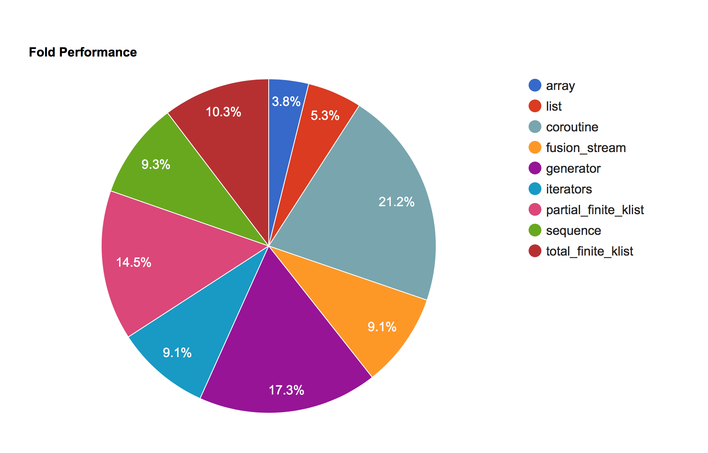
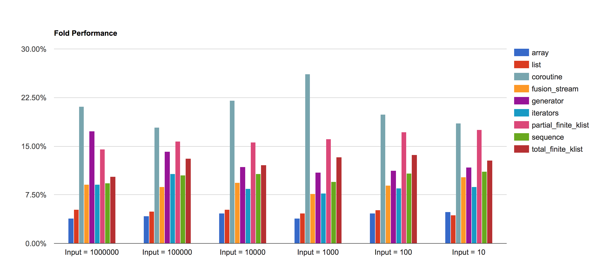
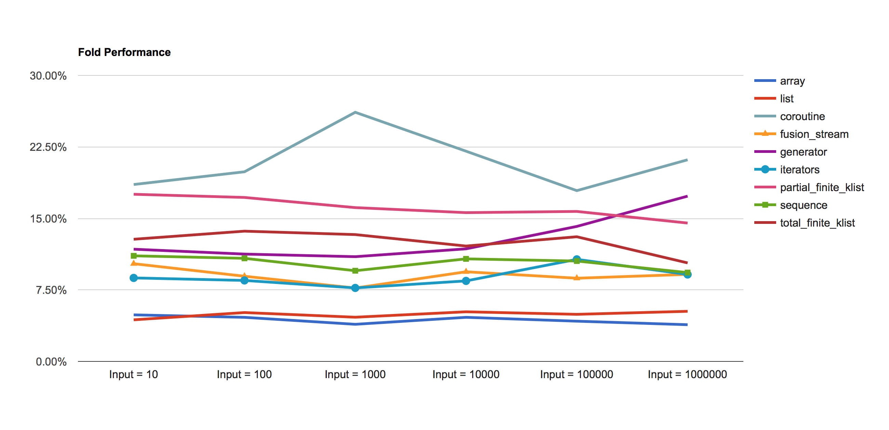

# Streams Bench

This repository contains the benchmarks for different streaming/iteration models:

- Coroutine
- Fusion stream
- Generator
- Iterator
- Partial finite klist
- Partial finite zlist
- Partial infinite klist
- Partial infinite zlist
- Sequence
- Strict finite list
- Total finite klist
- Total infinite klist
- Transducers

The implementation of the streams can be found in a separate repository [streams](https://github.com/rizo/streams).

This is an ongoing effort to understand and document the performance characteristics of the streaming models available for OCaml across a wide range of applications. Several tests will be implemented, synthetic and from real-world, with detailed analysis of the results.


## Fold Performance

This test is intended to measure the execution time of the simple `fold` operation on collections of integers of variable size.

```ocaml

(* Here [X] is the implementation to be tested and [input_len] is the number of
   elements: 10, 100, 1_000, 10_000, 100_000 and 1_000_000. *)

X.fold (+) 0 (init input_len (fun x -> x))
```

The benchmarks were performed with `core_bench` on a MacBook Pro, CPU 2,7 GHz Intel Core i5.

Here are some results:








All the results are available at public spreadsheet:

- <https://docs.google.com/spreadsheets/d/1QFaGbPLubUYJci09nC2LhvKRQease3PflQqtQzVZhpU/edit?usp=sharing>

